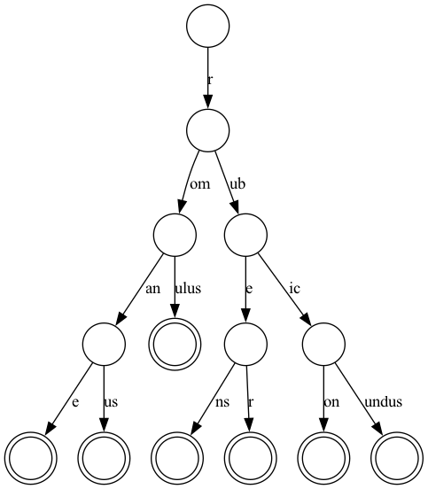
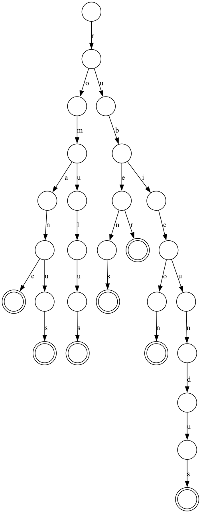

# Compressed Trie

A compressed trie (or radix tree) is a more space efficient form of a trie that retains the fast word and prefix lookup. It has the same big-O performance as a trie but in practice is faster because it uses fewer nodes and stores data in more cache-efficient ways.

Don't just take my word for it, here are some images. Side by side below are the compressed trie (left) and traditional trie (right) representations of the words romane, romanus, romulus, rubens, ruber, rubicon and rubicundus. A double circle represents the end of a word. Note that the compressed trie has 14 nodes, while the more traditional trie has 28. The longest path in the compressed trie is 4 and 10 in the traditional.

<p float="left">
  
  
</p>

Some real world node counts

| Num words | Trie Nodes | Compressed Trie Nodes |
| --------- | ---------- | --------------------- |
|    270    |     1063   |         377           |
|   2378    |     7540   |        3088           |
|   3447    |    10518   |        4439           |
|   5998    |    17695   |        7762           |
|   7740    |    22680   |        9743           |
|   21448   |    57955   |       25876           |
|   39182   |   101508   |       46123           |
|   87871   |   290779   |      102677           |
|  117093   |   368683   |      136145           |
|  260815   |  1333420   |      313641           |
|  595111   |  3182208   |      707806           |

## How to use

Currently the tree only supports the minimal set of features I needed, `Insert()`, `FindWordsWithPrefix()`, `Serialize()` and `Deserialize()`.

```go
    tree := compressedtrie.NewTree()
    example_words := []string{"test", "toaster", "toasting", "slow", "slowly"}

    for _, word := range example_words {
        tree.Insert(word)
    }

    tree.FindWordsByPrefix("t") // returns []string{"test", "toaster", "toasting"}
```

The (de-)serialization methods enable offline tree building

```go
    # In your offline builder
    f, err := os.Create("prefixes.ctrie")
    tree.Serialize(f)
    f.Close()
```

```go
    # In your runtime
    f, err := os.Open("prefixes.ctrie")
    tree := compressedtrie.Deserialize(f)
    f.Close()
```

Internally `Serialize()` and `Deserialize()` use buffered I/O to minimize memory overhead while laying out the file.

## Tests

```
go test .
```

Some of the tests use test files, which can be updated. Don't forget to check them in!

```
go test . -update
```
